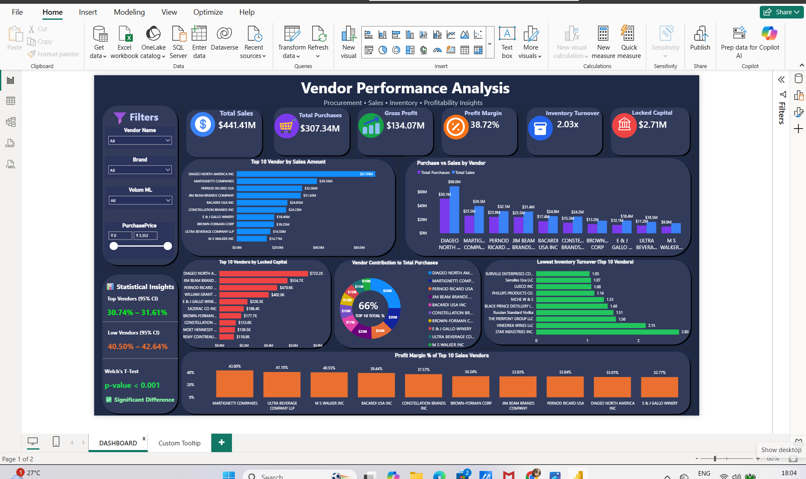

#  Vendor Performance Analysis using Python & Power BI

<p align="center">


</p>


> **End-to-End Data Analytics Project** using **Python, SQL, Statistics, Power BI, and Figma** to evaluate vendor performance, profitability, procurement efficiency, and inventory management.
##  Table of Contents

- <a href="#dashboard-preview">Dashboard Preview</a>
- <a href="#project-overview">Project Overview</a>
- <a href="#business-objectives">Business Objectives</a>
- <a href="#tech-stack">Tech Stack</a>
- <a href="#project-workflow">Project Workflow</a>
- <a href="#repository-structure">Repository Structure</a>
- <a href="#installation">Installation</a>
- <a href="#data-preparation">Data Preparation</a>
- <a href="#exploratory-data-analysis">Exploratory Data Analysis</a>
- <a href="#statistical-analysis">Statistical Analysis</a>
- <a href="#power-bi-dashboard">Power BI Dashboard</a>
- <a href="#key-business-insights">Key Business Insights</a>
- <a href="#business-recommendations">Business Recommendations</a>
- <a href="#project-deliverables">Project Deliverables</a>
- <a href="#future-improvements">Future Improvements</a>
- <a href="#skills-demonstrated">Skills Demonstrated</a>
- <a href="#author">Author</a>


---

##  Dashboard Preview


<p align="center">
  
</p>


---

#  Project Overview

Vendor performance plays a critical role in procurement planning, inventory management, and business profitability.

This project analyzes vendor performance using procurement and sales data to identify top-performing vendors, optimize purchasing decisions, reduce inventory costs, and improve overall business performance.

The project demonstrates a complete data analytics workflow, including **ELT, Exploratory Data Analysis (EDA), Statistical Analysis, and Interactive Dashboard Development**.

---

#  Business Objectives

- Identify top-performing vendors based on sales and profitability.
- Compare purchases with sales across vendors.
- Evaluate gross profit and profit margin.
- Analyze inventory turnover.
- Identify vendors contributing to locked capital.
- Perform statistical analysis to validate business findings.
- Build an interactive executive dashboard for decision-making.

---

#  Tech Stack

| Category | Tools |
|----------|-------|
| Programming | Python |
| Data Processing | Pandas, NumPy |
| Statistical Analysis | SciPy |
| Data Visualization | Matplotlib |
| Business Intelligence | Power BI |
| Dashboard Design | Figma |
| Version Control | Git & GitHub |

---

#  Project Workflow

```text
Raw Dataset
      │
      ▼
ELT Process
      │
      ▼
Final Dataset
      │
      ▼
Python EDA & Statistical Analysis
      │
      ▼
Power BI Dashboard
      │
      ▼
Business Insights & Recommendations
```

---

#  Repository Structure

```text
Vendor-Performance-Analysis/

│── README.md
│── LICENSE
│── requirements.txt

├── dashboard/
│   ├── Vendor_Performance_Analysis.pbix
│   ├── Vendor_Performance_Dashboard.pdf
│   └── Dashboard_Screenshot.png

├── elt/

├── final_dataset/

├── python/
│   └── 01_Exploratory_Data_Analysis.ipynb

├── raw_dataset/

└── report/
    └── Vendor_Performance_Report.ipynb
```

---
##  Installation

Clone the repository:

```bash
git clone https://github.com/Akshay7645/Vendor-Performance-Analysis.git
```

Navigate to the project folder:

```bash
cd Vendor-Performance-Analysis
```

Install the required libraries:

```bash
pip install -r requirements.txt
```

Launch Jupyter Notebook:

```bash
jupyter notebook
```
#  Data Preparation

The dataset was prepared using an ELT workflow.

The preprocessing pipeline included:

- Missing value assessment
- Duplicate removal
- Data type validation
- Feature engineering
- Data transformation
- Final dataset preparation for analysis and visualization

---

#  Exploratory Data Analysis

The EDA focused on understanding vendor performance through:

- Sales analysis
- Purchase analysis
- Gross profit analysis
- Profit margin analysis
- Inventory turnover analysis
- Locked capital analysis
- Vendor contribution analysis

---

#  Statistical Analysis

The project includes statistical validation using:

- 95% Confidence Interval
- Welch's Independent T-Test

These techniques were used to compare vendor groups and support business conclusions with statistical evidence.

---

#  Power BI Dashboard

The Power BI dashboard provides an interactive overview of vendor performance.

### KPI Cards

- Total Sales
- Total Purchases
- Gross Profit
- Profit Margin
- Inventory Turnover
- Locked Capital

---

### Dashboard Visualizations

- Top 10 Vendors by Sales
- Purchase vs Sales Comparison
- Top Vendors by Gross Profit
- Profit Margin Analysis
- Lowest Inventory Turnover
- Vendor Contribution to Total Purchases
- Locked Capital Analysis

---

### Interactive Features

- Vendor Filter
- Brand Filter
- Volume Filter
- Purchase Price Filter
- Custom Report Tooltip
- Cross Filtering
- Conditional Formatting

---

#  Key Business Insights

### Sales Performance

- A small number of vendors contribute a significant share of total sales.
- High sales volume does not always indicate higher profitability.

### Profitability

- Profit margins vary considerably across vendors.
- High-revenue vendors should also be evaluated based on profitability.

### Procurement

- Procurement spending is concentrated among a limited number of vendors.
- Regular supplier evaluation can improve purchasing efficiency.

### Inventory

- Vendors with low inventory turnover require procurement optimization.
- Excess inventory contributes to higher locked capital.

### Statistical Findings

- Statistical testing indicates meaningful differences in vendor performance.
- Confidence intervals provide additional support for comparing profitability across vendor groups.

---

#  Business Recommendations

- Focus on vendors with consistently high profit margins.
- Optimize procurement to reduce locked capital.
- Improve inventory turnover through better purchasing decisions.
- Strengthen long-term partnerships with high-performing vendors.
- Continuously monitor procurement efficiency using interactive dashboards.

---

#  Project Deliverables

- ELT Workflow
- Final Clean Dataset
- Exploratory Data Analysis Notebook
- Statistical Analysis
- Power BI Dashboard
- Dashboard PDF
- Project Report

---

#  Future Improvements

- Time Intelligence Analysis
- Forecasting
- Dynamic DAX Measures
- Drill-through Pages
- Executive Summary Dashboard
- Supplier Segmentation

---

#  Skills Demonstrated

- Data Cleaning
- Feature Engineering
- Exploratory Data Analysis
- Statistical Analysis
- Business Intelligence
- Dashboard Development
- Business Storytelling
- Data Visualization

---

#  Author

## Akshay Kumar


###  Connect with Me

<p align="left">

<a href="https://github.com/Akshay7645" target="_blank">

</a>

<a href="https://www.linkedin.com/in/akshay-paswan7645/" target="_blank">

</a>

</p> 

**Aspiring Data Analyst**
### Skills

- Python
- SQL
- Power BI
- Microsoft Excel
- Statistics
- Data Visualization

---

##  Support

If you found this project useful, consider giving it a  on GitHub.

Thank you for visiting this repository!